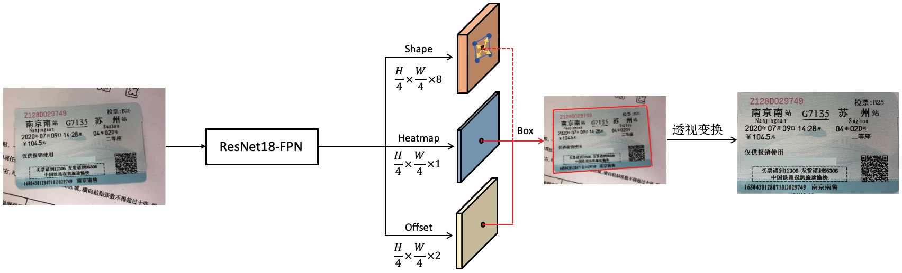
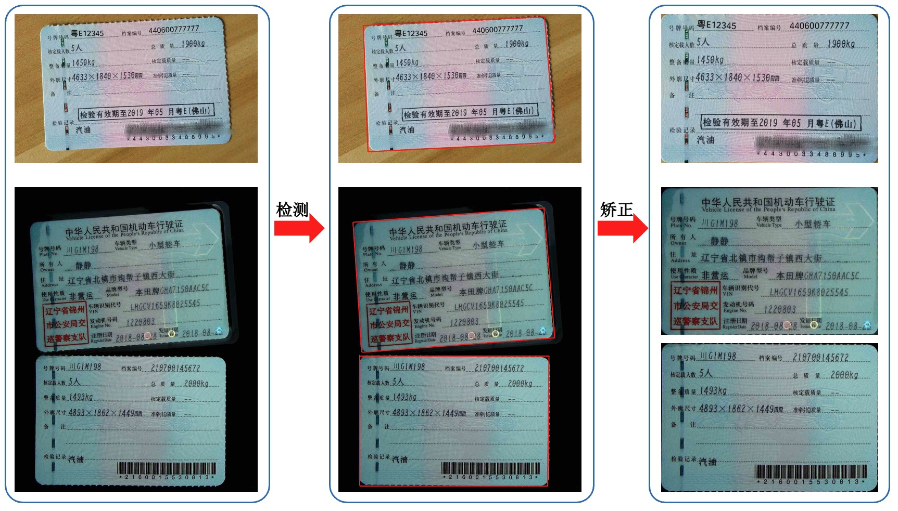

---
backbone:
- resnet18
domain:
- cv
frameworks:
- pytorch
language:
- en
- ch
license: Apache License 2.0
tags:
- OCR
- Alibaba
- 光学字符识别
- 卡证检测矫正
- 文字检测
- 文字识别
tasks:
- card-detection
- ocr-detection
- ocr-recognition
widgets:
  - version: 1
    model_revision: v0.1
    enable: true
    task: card-detection-correction
    examples:
      - name: 0
        inputs:
          - name: image
            data: git://data/demo3.jpg

      - name: 1
        inputs:
          - name: image
            data: git://data/demo.jpg

      - name: 2
        inputs:
          - name: image
            data: git://data/demo1.jpg

      - name: 3
        inputs:
          - name: image
            data: git://data/demo2.jpg

      - name: 4
        inputs:
          - name: image
            data: git://data/demo4.jpg

      - name: 5
        inputs:
          - name: image
            data: git://data/demo5.jpg

      - name: 6
        inputs:
          - name: image
            data: git://data/demo6.jpg

    inputs:
      - type: image
        displayType: ImageUploader
        validator:
          max_size: 3M
          max_resolution: 5000*5000
    output:
      displayType: ImageList
      displayValueMapping: output_imgs
      transformOutputs:
        output_imgs:
          type: image-list
    inferencespec:
      cpu: 2
      gpu: 1
      gpu_memory: 16000
      memory: 4000
---

# 票证检测矫正模型介绍
【读光商用矫正模型开源，快来体验吧】票证检测矫正模型在实际生活中有着广泛的需求，例如信息抽取、图像质量判断、证件扫描、票据审计等领等场景，可以大幅提高工作效率和准确性。本次 [读光团队](https://duguang.aliyun.com/) 开源了商用票证检测矫正模型，基于海量的真实数据训练，可以从容应对多种复杂场景的票证检测矫正任务，该模型具有以下优点：

* 支持任意角度、多卡证票据等混贴场景，同时检测输入图像任意角度的多个子图区域；
* 基于海量真实数据训练，效果满足国内常见的卡证票据的检测矫正需求；
* 支持子图区域复印件判断、四方向判断，准确率高达 99%；
* 矫正效果、推理速度远高于 modelScope 同类模型，详见本文测试报告。


##  模型效果评测
### 卡证场景


| 评测方式     | det_precison | det_recall | det_f-score | 方向判别 | 复印件判别 | 推理速度(FPS) |
| :----------- | :----------- | :--------- | :---------- | :----------- | :----------- | ------------ |
| [卡证检测矫正模型](https://modelscope.cn/models/damo/cv_resnet_carddetection_scrfd34gkps/summary) | 99.63%       | 96.80%     | 98.19%      | 无此能力 | 无此能力   | 1.83 |
| 读光-票证检测矫正模型 | 99.64%       | 99.85%     | 99.75%      | 99.78%       | 99.70%       | 14.30 |

备注：1）私有测试集，该测试集包含身份证、银行卡、驾驶证、行驶证等常见的卡证数据共计 1200 张；2）测试的速度均不包含后处理的图像透视变换；测试使用 GPU 型号：Tesla A100-PCIE-80GB

### 票据场景

| 评测方式     | det_precison | det_recall | det_f-score | 方向判别 | 复印件判别 | 推理速度(FPS) |
| :----------- | :----------- | :--------- | :---------- | :----------- | :----------- | ------------ |
| [卡证检测矫正模型](https://modelscope.cn/models/damo/cv_resnet_carddetection_scrfd34gkps/summary) | 98.90%       | 82.43%     | 89.92%      | 无此能力   | 无此能力 | 1.79 |
| 读光-票证检测矫正模型 | 99.92%       | 100.00%    | 99.96%      | 99.83% | 99.17%       | 12.55 |

备注：1）私有测试集，该测试集包含营业执照、增值税发票、机动车销售发票、出生证明等常见的票据和资质数据共计 1200 张；2）测试的速度均不包含后处理的图像透视变换；测试使用 GPU 型号：Tesla A100-PCIE-80GB

## 模型描述

下图是实现流程：输入图片，基于 Resnet18-FPN 提取特征后，在 1/4 尺寸处通过三条分支分别识别出票证的中心点、偏移量（中心点到4个顶点距离）、中心点偏移量（为了得到精准的中心点），即可解码数出票证区域的四边形框；再用透视变换将票证拉平得到矫正后的票证信息；与此同时，分类分支识别出子图朝向，用于而切割的子图转正。



## 效果展示

下图是模型效果：



## 期望模型使用方式以及适用范围
输入图片，模型自动检测出所有票证并矫正为水平图片。用户可以自行尝试各种输入图片。具体调用方式请参考代码示例。

### 如何使用
在安装完成 ModelScope 之后即可使用 card-detection-correction 的能力。

### 算法流程
测试时的主要预处理和后处理如下：
- 图像预处理：将输入图片按照比例缩放，长边 Resize 到 768，短边 Pad 到长短边相等，同时有减均值、除方差等归一化操作。
- 模型卡证区域检测：对输入图像中的卡证票据区域进行检测，并对 `卡证票据的方向` 和 `复印件类型` 进行分类；
- 后处理矫正：根据 `卡证区域检测框` 和 `卡证票据的方向` 对卡证区域进行透视变化，并转为水平方向；

### 使用范例
```python
from modelscope.pipelines import pipeline
from modelscope.utils.constant import Tasks
card_detection_correction = pipeline(Tasks.card_detection_correction, model='damo/cv_resnet18_card_correction')
result = card_detection_correction('https://modelscope.oss-cn-beijing.aliyuncs.com/test/images/card_detection_correction.jpg')
print(result)
```

### 输出字段定义

| 字段名称 | 说明                                                         |
| -------- | ------------------------------------------------------------ |
| polygons | 框检得到的任意四边形四个顶点，依次为左上、右上、右下、左下   |
| scores | 框检置信度，标识检测的可行度，值域 0 到 1 之间              |
| labels | 卡证方向分类，枚举类型，0、1、2、3 依次表示卡证顺时针旋转 90度、180度、270度 |
| layout | 复印件分类，枚举类型，0 表示非复印件，1 表示复印件 |
| output_imgs | 矫正后的子图区域像素值 |

所有字段第一个维度的长度相等且一一对应，为图片中票证的数量。比如polygons[0]、scores[0]、labels[0]、layout[0]、output_imgs[0]表示第一个子图的坐标、置信度、方向、是否复印件、拉平后的子图。


## 模型训练流程
本模型利用 imageNet 预训练参数进行初始化，然后在海量真实场景训练数据集上进行训练；本模型暂不支持用户自行训练；

---

# 票证检测矫正 HTTP 服务

基于上述模型封装的推理服务：上传一张图片（支持多卡证混贴、任意角度），原图与矫正后子图全部写入 RustFS（S3 兼容）对象存储，接口只返回**预签名 URL**（不再返回 base64）。

## 快速开始

```bash
python3 -m venv .venv
.venv/bin/pip install -r requirements.txt
# 编辑 service_config.json 填入 RustFS endpoint / access_key / secret_key / bucket
.venv/bin/uvicorn app:app --host 0.0.0.0 --port 8300
```

- 接口文档: `http://127.0.0.1:8300/docs`
- 健康检查: `GET /health`
- 批量效果测试: `.venv/bin/python test_service.py`（结果保存到 `output/`）

## 接口

所有 `/api/*` 接口默认需要 API Key 鉴权,`/health` 与 `/docs` 不需要。

请求头二选一:
- `X-API-Key: <your_key>`
- `Authorization: Bearer <your_key>`

| 接口 | 鉴权 | 说明 |
|---|---|---|
| `POST /api/upload` | 需要 | 仅上传原图到 RustFS,返回 `{request_id, object:{key,url,expires_in}}` |
| `POST /api/correct` | 需要 | 上传原图 + 检测矫正 + 上传每张子图,返回原图与所有子图的预签名 URL,外加 `score`/`polygon`/方向/复印件等元数据 |
| `GET /health` | 不需要 | 健康检查(Docker HEALTHCHECK 依赖) |

响应中所有 `url` 均为预签名 URL,过期时间由 `url_expires_seconds` 控制。

## 配置(service_config.json)

### RustFS / S3

| 配置项 | 默认 | 说明 |
|---|---|---|
| `endpoint` | `http://192.168.2.61:9001` | RustFS / S3 兼容服务地址 |
| `access_key` / `secret_key` | — | 访问凭据 |
| `bucket` | `card-correction` | 存储桶;不存在且 `auto_create_bucket=true` 时启动会自动创建 |
| `region` | `us-east-1` | S3 区域 |
| `prefix` | `card-correction` | 对象 key 前缀;最终 key 形如 `{prefix}/YYYY-MM-DD/{request_id}_upload.jpg` |
| `url_expires_seconds` | `3600` | 预签名 URL 过期秒数 |
| `auto_create_bucket` | `true` | bucket 不存在时是否自动创建 |
| `addressing_style` | `path` | 自建 S3 兼容服务通常用 `path` |

### 鉴权(OpenAPI)

| 配置项 | 默认 | 说明 |
|---|---|---|
| `auth.enabled` | `true` | 鉴权总开关 |
| `auth.api_keys` | `[]` | 允许的 API Key 列表;**为空时鉴权自动关闭**(本地调试友好) |

环境变量覆盖:`API_KEYS=key1,key2`(逗号分隔)、`AUTH_ENABLED=true/false`。

### Nacos 服务注册

| 配置项 | 默认 | 环境变量 |
|---|---|---|
| `nacos.enabled` | `true` | `NACOS_ENABLED` |
| `nacos.server_addr` | `192.168.2.61:8848` | `NACOS_SERVER_ADDR` |
| `nacos.namespace` | `""` (public) | `NACOS_NAMESPACE` |
| `nacos.group` | `DEFAULT_GROUP` | `NACOS_GROUP` |
| `nacos.username` / `nacos.password` | `""` | `NACOS_USERNAME` / `NACOS_PASSWORD` |
| `nacos.service_name` | `card-correction` | `NACOS_SERVICE_NAME` |
| `nacos.register_ip` | 自动探测 | `NACOS_REGISTER_IP`(**Docker 部署必须显式传宿主机 IP**) |
| `nacos.register_port` | `8300` | `NACOS_REGISTER_PORT`(双卡 GPU 第二个实例必须改成 `8301`) |

启动时注册,进程退出时注销。Nacos 不可达只会打日志,不影响服务本身。

## Docker

```bash
# CPU
docker compose -f docker-compose.cpu.yml up -d --build

# GPU 单卡（需 NVIDIA 驱动 + nvidia-container-toolkit）
docker compose -f docker-compose.gpu.yml up -d --build

# GPU 双卡（每卡一个实例，端口 8300/8301）
docker compose -f docker-compose.gpu2.yml up -d --build
```

GPU 镜像基于 `pytorch/pytorch:2.6.0-cuda12.4-cudnn9-runtime`（已验证包含 sm_70，支持 V100）。`service_config.json` 已被 COPY 进镜像；如需让运行时配置改动在容器重建后保留，取消 compose 文件中 `./service_config.json:/app/service_config.json` 的挂载注释。
